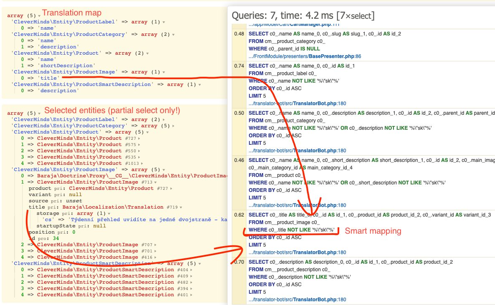

Translator bot
==============

Automatic robot for machine translation by Google Translator of Doctrine entities + automatic flush of new translated content.



📦 Installation
---------------

It's best to use [Composer](https://getcomposer.org) for installation, and you can also find the package on
[Packagist](https://packagist.org/packages/baraja-core/translator-bot) and
[GitHub](https://github.com/baraja-core/translator-bot).

To install, simply use the command:

```
$ composer require baraja-core/translator-bot
```

You can use the package manually by creating an instance of the internal classes, or register a DIC extension to link the services directly to the Nette Framework.

📄 License
-----------

`baraja-core/translator-bot` is licensed under the MIT license. See the [LICENSE](https://github.com/baraja-core/template/blob/master/LICENSE) file for more details.
